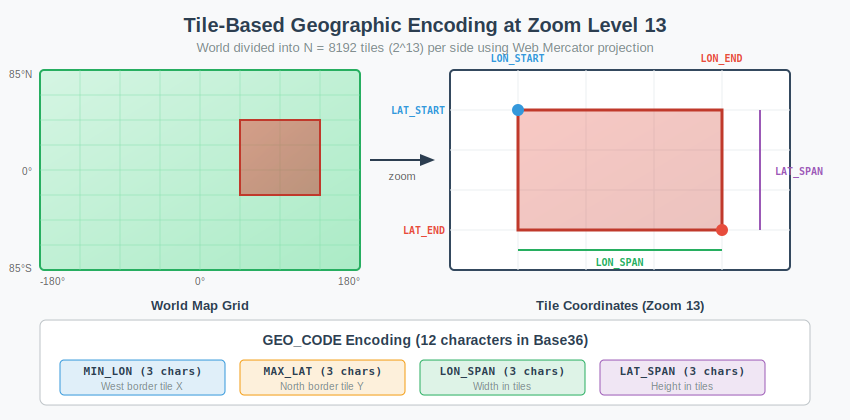
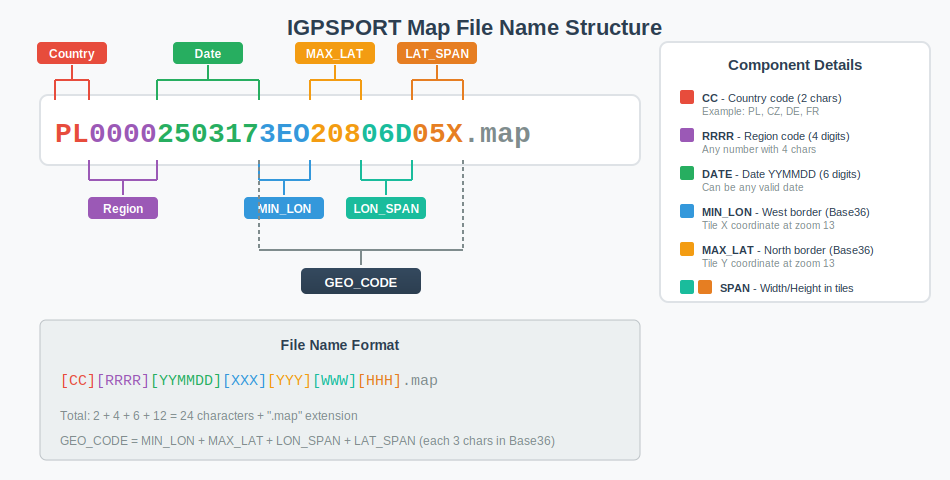

# IGPSPORT Map Updater

A tool to generate custom map files for IGPSPORT devices from OpenStreetMap data. This project downloads OSM PBF files, filters them based on polygons, and generates Mapsforge map files with specific naming conventions for IGPSPORT GPS devices.

## Supported Products

- BiNavi
- iGS800
- iGS630
- iGS630S
- BSC300T
- BSC300

Official support/download page: https://www.igpsport.com/en/support/product

## Requirements

- **Java 17** or higher
- **Internet connection** (for downloading OSM data and dependencies)
- **Disk space**: Several GB depending on the size of the regions being processed

### Platform-Specific Requirements

#### Windows
- PowerShell 5.0 or higher (included in Windows 10/11)
- Windows 7 or higher

#### Unix/Linux/macOS
- Bash shell
- `curl` (for downloading files)
- `unzip` (for extracting archives)
- `bc` (for mathematical calculations)

## Important Notes

### Before You Start

⚠️ **Use At Your Own Risk**: Do it at your own risk; I am not responsible for broken devices.

⚠️ **Backup Your Maps**: Before using the new maps, make sure to backup your existing maps from your IGPSPORT cycle computer. Store them in a safe location in case you need to revert.

⚠️ **Free Up Space**: Remove old maps from your cycle computer before transferring new ones. The new maps are significantly larger due to enhanced tags and more detailed information, so you'll need extra storage space.

⚠️ **Processing Time**: The map conversion process takes several hours to complete, depending on the size of the regions and your computer's performance. Plan accordingly and let the script run without interruption.

### Map Size Changes

The generated maps are **larger than original IGPSPORT maps** because they include:
- More detailed road networks
- Additional map features (waterways, landuse, natural features)
- Enhanced tagging information for better routing
- Extended geographic data

### Original vs Enhanced Tags

**Original IGPSPORT maps included only 20 basic tags:**
```
highway=cycleway
highway=footway
highway=living_street
highway=path
highway=pedestrian
highway=primary
highway=primary_link
highway=residential
highway=road
highway=secondary
highway=secondary_link
highway=service
highway=tertiary
highway=tertiary_link
highway=track
highway=trunk
highway=trunk_link
highway=unclassified
natural=coastline
natural=water
```

**Enhanced maps include many additional features:**

**Highway types (37 types):**
- Major roads (zoom 13): motorway, motorway_link, primary, primary_link, secondary, secondary_link, trunk, trunk_link, tertiary, tertiary_link
- Minor roads & paths (zoom 14): bridleway, bus_guideway, byway, construction, cycleway, footway, living_street, path, pedestrian, raceway, residential, road, service, services, steps, track, unclassified

**Natural features (zoom 13):**
- coastline, water

**Waterways (zoom 14):**
- canal, dam, drain, river, stream

See [tag-igpsport.xml](tag-igpsport.xml) for the complete tag configuration used in this project.

For a comprehensive list of all available OpenStreetMap tags that can be included in Mapsforge maps, see the [Mapsforge tag-mapping reference](https://github.com/mapsforge/mapsforge/blob/master/mapsforge-map-writer/src/main/config/tag-mapping.xml).

## How to Run

### Windows

Run the PowerShell script:

```powershell
.\script.ps1
```

Or right-click `script.ps1` and select "Run with PowerShell"

### Unix/Linux/macOS

Make the script executable and run it:

```bash
chmod +x script.sh
./script.sh
```

## What the Script Does

1. **Downloads Osmosis** (if not present) - OpenStreetMap data processing tool
2. **Downloads Mapsforge Writer Plugin** - Converts OSM data to map format
3. **Reads maps.csv** - Configuration file with region definitions
4. **Downloads OSM PBF files** - Raw OpenStreetMap data
5. **Downloads Polygon files** - Define geographic boundaries
6. **Processes maps** - Filters and converts data to IGPSPORT format
7. **Generates filenames** - Creates properly formatted output files

## CSV File Structure

The `maps.csv` file defines which regions to process. It has three columns:

| Column | Description | Example |
|--------|-------------|---------|
| **Original filename** | The target IGPSPORT map filename format | `BR01002303102B83FO00N00E.map` |
| **OSM BPF URL** | URL to download the OpenStreetMap PBF file | `https://download.geofabrik.de/south-america/brazil-latest.osm.pbf` |
| **Poly URL** | URL to download the polygon boundary file | `https://download.openstreetmap.fr/polygons/south-america/brazil/central-west/distrito-federal.poly` |

### Example CSV Content

```csv
Original filename,OSM BPF URL,Poly URL
BR01002303102B83FO00N00E.map,https://download.geofabrik.de/south-america/brazil-latest.osm.pbf,https://download.openstreetmap.fr/polygons/south-america/brazil/central-west/distrito-federal.poly
BR02002303102833DN04O04Q.map,https://download.geofabrik.de/south-america/brazil-latest.osm.pbf,https://download.openstreetmap.fr/polygons/south-america/brazil/central-west/goias.poly
```

### Where to Find Resources

- **OSM PBF files**: [Geofabrik Downloads](https://download.geofabrik.de/)
- **Polygon files**: [OpenStreetMap Polygons](https://download.openstreetmap.fr/polygons/)

## Directory Structure

```
igpsport-map-updater/
├── script.sh                # Unix/Linux/macOS execution script
├── script.ps1               # Windows PowerShell execution script
├── maps.csv                 # Configuration file with map definitions
├── tag-igpsport.xml         # Tag configuration for Mapsforge writer
├── download/                # Downloaded OSM PBF and polygon files
│   ├── *.osm.pbf
│   └── *.poly
├── output/                  # Generated map files (final output)
│   └── *.map
├── tmp/                     # Temporary files during processing
├── misc/                    # Documentation and diagrams
│   ├── filename-structure.svg
│   └── tile-grid-concept.svg
└── osmosis-0.49.2/          # Osmosis tool (auto-downloaded)
    ├── bin/
    ├── lib/
    └── script/
```

### Directory Descriptions

- **download/**: Stores downloaded OSM PBF files and polygon boundary files. Files are cached to avoid re-downloading.
- **output/**: Contains the final generated `.map` files with IGPSPORT-compatible filenames.
- **tmp/**: Temporary directory used by Osmosis during processing (can be deleted after completion).
- **misc/**: Contains SVG diagrams explaining the filename structure and tile grid concepts.
- **osmosis-0.49.2/**: Automatically downloaded and extracted Osmosis tool with Mapsforge plugin.

## IGPSPORT Filename Structure

The generated map files follow a specific naming convention required by IGPSPORT devices:

### Format

```
[CC][RRRR][YYMMDD][GEOCODE].map
```

### Components

| Component | Length | Description | Example |
|-----------|--------|-------------|---------|
| **CC** | 2 chars | Country code | `BR`, `PL`, `US` |
| **RRRR** | 4 digits | Region/Product code | `0100`, `0200` |
| **YYMMDD** | 6 digits | Date (Year, Month, Day) | `250317` = March 17, 2025 |
| **GEOCODE** | 12 chars | Geographic boundary encoding | `2B83FO00N00E` |

### GEOCODE Breakdown (12 characters, Base36 encoding)

The GEOCODE consists of 4 parts, each 3 characters in Base36:

1. **MIN_LON** (XXX): Western boundary - minimum longitude as tile X coordinate at zoom 13
2. **MAX_LAT** (YYY): Northern boundary - maximum latitude as tile Y coordinate at zoom 13
3. **LON_SPAN** (WWW): Width in tiles - 1 (horizontal span)
4. **LAT_SPAN** (HHH): Height in tiles - 1 (vertical span)



### Example

**Filename**: `BR01002303102B83FO00N00E.map`

- **BR**: Brazil
- **0100**: Region code 0100
- **230310**: March 10, 2023
- **2B8**: MIN_LON (tile X at zoom 13)
- **3FO**: MAX_LAT (tile Y at zoom 13)
- **00N**: LON_SPAN (width in tiles)
- **00E**: LAT_SPAN (height in tiles)

For a visual representation of the filename structure, see below:



## Viewing and Comparing Maps

### Cruiser - Map Viewer

[Cruiser](https://wiki.openstreetmap.org/wiki/Cruiser) is a cross-platform map viewer that supports Mapsforge map files, making it ideal for viewing and comparing the generated maps.

#### Features
- View `.map` files generated by this tool
- Compare different map versions
- Test maps before deploying to IGPSPORT devices
- Supports multiple map formats including Mapsforge

#### Download
Visit the [Cruiser Wiki page](https://wiki.openstreetmap.org/wiki/Cruiser) for download links and documentation.

#### Usage
1. Open Cruiser
2. Load your generated `.map` file from the `output/` directory
3. Compare with other map versions or sources

#### Comparison Example

Below is a comparison showing the difference between the original IGPSPORT map (left) and the enhanced map (right) with additional features and details:


*Left: Original map with 20 basic tags | Right: Enhanced map with 37+ highway types, waterways, and natural features*

### Other Compatible Viewers
- **Oruxmaps** (Android)
- **Locus Map** (Android)
- **c:geo** (Android)

## Troubleshooting

### Java Not Found
Ensure Java 17 or higher is installed:
```bash
java -version
```

### Out of Memory Errors
Increase Java heap size by editing the `JAVA_OPTS` variable in the script:
```bash
export JAVA_OPTS="-Xms2g -Xmx16g -Djava.io.tmpdir=$TMP_DIR"
```

### Download Failures
- Check your internet connection
- Verify the URLs in `maps.csv` are accessible
- Some regions may have updated URLs on Geofabrik

### Permission Denied (Unix/Linux)
Make the script executable:
```bash
chmod +x script.sh
```

## Technical Details

### Processing Pipeline

1. **Read PBF** → Load OpenStreetMap binary data
2. **Apply Polygon** → Filter data to geographic boundary
3. **Tag Filter** → Remove unwanted features, keep roads, waterways, landuse
4. **Used Node** → Keep only referenced nodes
5. **Merge** → Combine filtered data
6. **Mapfile Writer** → Generate Mapsforge `.map` file
7. **Rename** → Calculate GEOCODE and apply IGPSPORT filename

### Map Features Included

The script filters OSM data to include:
- **Roads**: highways, paths, tracks
- **Waterways**: rivers, streams, canals
- **Landuse**: forests, fields, parks
- **Natural features**: water bodies, coastlines
- **Places**: cities, towns, villages

All other features (buildings, POIs, etc.) are filtered out to reduce file size and focus on navigation.

## License

This project uses:
- **Osmosis**: LGPL
- **Mapsforge**: LGPL
- **OpenStreetMap Data**: ODbL

## References

- [Reddit thread](https://www.reddit.com/r/cycling/comments/1khm2ou/newcustom_maps_on_igpsport_bsc300t_630s) shared by [u/povlhp](https://www.reddit.com/user/povlhp/) 
- [Original project](https://github.com/tm-cms/MapsforgeMapName) by [tm-cms](https://github.com/tm-cms)
- [OpenStreetMap](https://www.openstreetmap.org/)
- [OpenStreetMap France](https://download.openstreetmap.fr/)
- [Geofabrik Downloads](https://download.geofabrik.de/)
- [Osmosis Documentation](https://wiki.openstreetmap.org/wiki/Osmosis)
- [Mapsforge](https://github.com/mapsforge/mapsforge)
- [Cruiser Map Viewer](https://wiki.openstreetmap.org/wiki/Cruiser)
